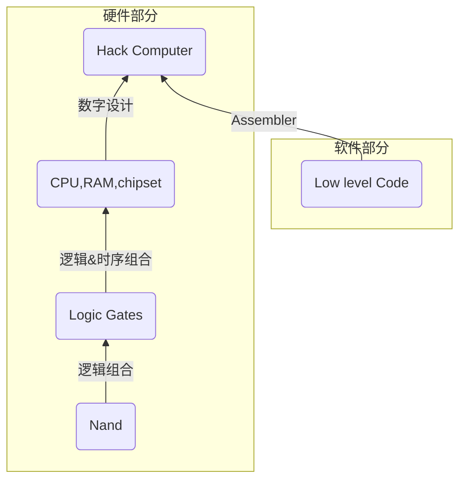

# 依据基本原理构建现代计算机：从与非门到俄罗斯方块

这是一篇[Nand2Tetris](https://www.coursera.org/learn/build-a-computer/)的课程笔记。课程是站在CS专业的视角来看的，不会涉及EE相关的具体物理电路设计。


## WEEK0

### 课程架构



### 课程内容

1. 编写基本的15个逻辑门
2. 建立算术逻辑单元ALU
3. 建立内存系统
4. 编写机器语言
5. 设计Hack
6. 编写汇编器

## WEEK1

### 布尔逻辑

这一部分可以参考EE的数字电路基础知识

#### 布尔操作

| x    | y    | AND$\and$ | OR$\or$ |
| ---- | ---- | --------- | ------- |
| 0    | 0    | 0         | 0       |
| 0    | 1    | 0         | 1       |
| 1    | 0    | 0         | 1       |
| 1    | 1    | 1         | 1       |

还有一个简单的非，也就是NOT$\neg$，即取反操作。

#### 布尔表达式

就像算术表达式一样，布尔操作也可以和括号一起进行复杂的运算

#### 布尔函数

就想普通的函数一样，布尔运算也可以定义自己的函数，只是定义域只有0和1
$$
f(x,y,z)=(x \and y)\or(\neg x \and z)
$$

| x    | y    | z    | f(x,y,z) |
| ---- | ---- | ---- | -------- |
| 0    | 0    | 0    | 0        |
| 0    | 0    | 1    | 1        |
| 0    | 1    | 0    | 0        |
| 0    | 1    | 1    | 1        |
| …    | …    | …    | …        |

#### 布尔恒等式

+ 交换律
+ 结合律
+ 分配律
+ 德摩根律

| 交换律             | $A\or B = B\or A$                         | $A \and B = B\and A$                   |
| ------------------ | ----------------------------------------- | -------------------------------------- |
| 结合律             | $A\or B\or C = A\or (B\or C)$             | $A\and B\and C = A\and (B\and C)$      |
| **分配律**         | $A\and (B\or C) = (A\and B)\or (A\and C)$ | $A\or B\and C = (A\or B)\and (A\or C)$ |
| 反演律（德摩根律） | $\neg{(A\or B)} = \neg{A}\and\neg{B}$     | $\neg{(A\and B)} = \neg{A}\or \neg{B}$ |

### 布尔函数综合

#### 构建范式

>由有限个简单析取式构成的合取式称为**合取范式**。
>
>由有限个简单合取式构成的析取式称为**析取范式**。
>
>析取范式与合取范式统称为**范式**。

这是来自离散数学的概念，翻译成人话：

对于一个布尔函数而言，他的真值表结果列 $f$ 有 1 有 0，我们将结果为 **0** 的行取出。在行中用 **OR**（析取） 连接各个变量，每一行都称为一个简单的**析取式**，在行间用 **AND**（合取）连接，最终得到一个**合取范式**。那么析取范式就是合取范式的相反操作。

通过构建范式，我们可以找到一个复杂的布尔函数（表达式），真正反映他取值的部分是那些。因为合取范式和析取范式都分别与原始的式子等价。

#### 一些理论

通过范式我们可以发现，任何复杂的布尔函数都可以表达为简单的与或非组合。算上**德摩根律**，我们甚至可以抛弃掉与门或者或门。只用**与门**、**非门**或者只用**或门**、**非门**来完成电路。
$$
x \or y = \neg(\neg x \and \neg y)\\
x \and y = \neg(\neg x \or \neg y)
$$
接着介绍一种特殊的门，与非门（NAND）：

| x    | y    | f    |
| ---- | ---- | ---- |
| 0    | 0    | 1    |
| 0    | 1    | 1    |
| 1    | 0    | 1    |
| 1    | 1    | 0    |

不难发现，这是对**与门**的取反。

通过上面的简单理论，如果我们能证明**与非门**能同时做到**与门**和**非门**的功能，那么它将可以以一己之力创建任何电路。

结果是非常的amazing啊。
$$
NOT\ (x) = (x\ NAND\ x)\\
x\ AND \ y =NOT(x\ NAND\ y)
$$

所以我们可以得到结论：**与非门可以表示任何电路**

### 逻辑门

逻辑门可以理解为一种非常简单的芯片，用于实现预先说明的逻辑。简单的逻辑门可以组合成复杂的逻辑门。

下面来描述一些常见的逻辑门

|                       类型                       | [ANSI](https://zh.wikipedia.org/wiki/美国国家标准学会)及[IEEE](https://zh.wikipedia.org/wiki/电气电子工程师学会)标准 |   [IEC](https://zh.wikipedia.org/wiki/国际电工委员会)标准    |    名称    |
| :----------------------------------------------: | :----------------------------------------------------------: | :----------------------------------------------------------: | :--------: |
|  **[AND](https://zh.wikipedia.org/wiki/与门)**   | [](https://zh.wikipedia.org/wiki/File:AND_ANSI.svg) | [](https://zh.wikipedia.org/wiki/File:IEC_AND.svg) |  “**与**”  |
|   **[OR](https://zh.wikipedia.org/wiki/或门)**   | [](https://zh.wikipedia.org/wiki/File:OR_ANSI.svg) | [](https://zh.wikipedia.org/wiki/File:IEC_OR.svg) |  “**或**”  |
| **[NOT](https://zh.wikipedia.org/wiki/反相器)**  | [](https://zh.wikipedia.org/wiki/File:NOT_ANSI.svg) | [](https://zh.wikipedia.org/wiki/File:IEC_NOT.svg) |  “**非**”  |
| **[NAND](https://zh.wikipedia.org/wiki/与非门)** | [](https://zh.wikipedia.org/wiki/File:NAND_ANSI.svg) | [](https://zh.wikipedia.org/wiki/File:IEC_NAND.svg) | “**与非**” |
| **[XOR](https://zh.wikipedia.org/wiki/异或门)**  | [](https://zh.wikipedia.org/wiki/File:XOR_ANSI.svg) | [](https://zh.wikipedia.org/wiki/File:IEC_XOR.svg) | “**异或**” |

```bash
AND
if (a==1 and b==1)
	out=1	else	out=0
OR
if (a==1 or b==1)
	out=1 else out=0
NOT
if (in==0)
	out=1 else out=0
NAND
if (a==0 and b==0)
	out=1 else out=0
XOR
if (a!=b)
	out=1 else out=0
```

当然，用自然语言或者真值表叙述也是很好的方法。

一些复杂门也只是简单门输入和输出的链接左半部分称为门的接口（interface），右半部分称为门的实现（implementations）


### HDL

HDL，硬件描述语言，允许我们在软件层面模拟建造，调试，测试我们搭建的电路。

以异或芯片为例：

```verilog
CHIP Xor{
  // 接口
	IN a,b;
	OUT out;
	
	PARTS:
	// 具体实现
}
```

我们假设我们已经实现了基本的与或非门，可以无限制地使用他们。通过分析异或门的真值表以及**经验**，我们可以画出：


对于我们拥有的每一个芯片部件，我们只写一个单独的描述芯片语句（类似函数的调用）。

```verilog
CHIP Xor{
  //接口
	IN a,b;
	OUT out;
	
	PARTS:
	// 具体实现
  Not (in=a, out=nota);
  Not (in=b, out=notb);
  And (a=a, b=notb, out=aAndNotb);
  And (a=nota, b=b, out=NotaAndb);
  Or  (a=aAndNotb, b=NotaAndb, out=out);
}
```

+ HDL 是一种声明型语言，只是对门图的静态描述。
+ 在本课程中，单输入为 **in** ，单输出为 **out** ，双输入为 **ab** 。
+ VHDL 和 Verilog 是工业常用的 HDL，但本课程所用的是自己研发的简单版本。
+ 推荐使用VSCode，以及搭配[N2T插件](https://marketplace.visualstudio.com/items?itemName=loyio.Nand2Tetris-vscode)编写代码

### 硬件模拟

HDL本身没有任何的模拟功能，我们需要外部的工具来验证我们的设计。这就是硬件模拟(Hardware Simulation)。我们将编写好的HDL代码以及测试代码（Input pins）同时导入到模拟器中即可通过对比输出（Output pins）与标准输出来验证我们的设计。


### 总线

- 信息传输

　　　　总线(BUS)实际上是由许多传输线或通路组成的，每条线可一位一位地传输二进制代码，一串二进制代码可在一段时间内逐一传输完成。若干条传输线可以同时传输若干位二进制代码。

　　　　串行：每条线一位接一位的传输二进制代码，一串二进制代码可在一段时间内逐一传输完成。

　　　　并行：若干条传输线可以同时传输若干位二进制代码，如，16条传输线组成的总线可同时传输16位二进制代码。

- 共享

　　　　总线是连接多个部件的信息传输线，是各部件共享的传输介质。

- 分时(总线上信息传输的特征)

　　　　在某一时刻，只允许有一个部件向总线发送信息，而多个部件可以同时从总线上接收**相同的**信息。

　　　　总线由**总线控制器**管理，总线控制器的主要功能有总线系统的**资源管理**、总线系统的**定时**及总线的**仲裁**和**连接**。

用HDL描述一个总线宽度为16位的加法器：

```verilog
CHIP Add16{
	IN a[16],b[16];
	OUT out[16];
	
	PARTS:
		...
}
```

那么如果我们要描述一个16位加16位加16位的三加器呢？That's EZ

```verilog
CHIP Add3Way16{
	IN a[16],b[16],c[16];
	OUT out[16];
	
	PARTS:
		Add16(a=a, b=b, out=temp);
		Add16(a=temp, b=c, out=out);
}
```

上面是抽象的加法器，但在事实的电路里，我们的加法运算其实是对每一个比特(bit)进行**与**运算。在HDL中，我们可以通过下标的形式访问总线的某一比特位，与其他编程语言一样，从0计数。

+ HDL的切片技巧：a[0..7]，左闭右闭
+ a[0]表示最右边的bit，也就是最低位bit

### 实验

+ NAND给定
+ 构建出15个逻辑门


| 基础门    | 思路                                                         |
| --------- | ------------------------------------------------------------ |
| Not       | Nand 本身带有 Not 的功能                                     |
| And       | Nand 是 And 的取反，所以再反一次即可                         |
| Or        | 对 And 使用德摩根律                                          |
| Xor       | 由于不好直接判断相同，所以我们可以选择判断不同               |
| Mux       | Mux 是数据选择器，或称**多路复用器**，有条件语句的感觉了。考虑输出为1的情况，对于 a 来说，只有当 a 与 !sel 同时为1时输出1，对于 b 来说，只有当 b 和 sel 同时为1时输出1。判定同为1我们可以用 And 搞定。最后使用 Or 得到输出。 |
| DMux      | DMux可以理解为Mux的解，或者说是一对编解码。同样的，让我们只考虑 a 和 b 的情况，对于 a 来说，只有当 in 与 !sel 同时为1时输出1，对于 b 来说，只有当 in 和 sel 同时为1时输出1。判定同为1我们可以用 And 作为输出，也就是答案。 |
| Not16     | 总线宽度为16位的Not，写16遍Not                               |
| And16     | 总线宽度为16位的And，写16遍And                               |
| Or16      | 总线宽度为16位的Or，写16遍Or                                 |
| Mux16     | 总线宽度为16位的Mux，写16遍Mux                               |
| Or8Way    | 对8个bit 进行或运算，总共要用 4+2+1 个或门                   |
| Mux4Way16 | 总线宽度为16位，4Way意味着有四个输入 a b c d，那么 sel 也要有4种情况，即 sel 为2个bit位。那么对 ab 和 cd 分别以 sel[0] 进行 Mux16，最后再以sel[1] 进行 Mux16 输出即可 |
| Mux8Way16 | 思路和 Mux4Way16 是一样的，无非是数字变多了。但是我们已经实现了4路的版本，所以可以和 Mux4Way16 一样，使用三次即可得到答案，只需要注意最后仍然是 Mux16，且选择器为 sel[2]。 |
| DMux4Way  | 先用 sel[1] 进行 DMux，得到一个新的输入 w 和 一个0，然后再以 sel[0] 分别对 ab cd 进行 DMux即可得到答案。 |
| DMux8Way  | 先用 sel[2] 进行 DMux，得到一个新的输入 w 和 一个0，然后再以 sel[0..1] 分别对 abcd efgh 进行 DMux4Way 即可得到答案。 |

