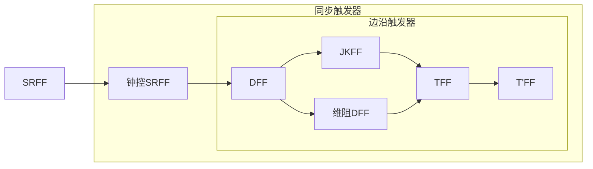

# 数字电路

## 数制与码制

本章首先介绍了数字电路中的一些基本概念及数字电路中常用的数制与码制；然后介绍二进制数的算术运算及数字逻辑中的基本逻辑运算；最后介绍硬件的描述语言。

### 数字信号与数字电路概述

#### 数字信号与模拟信号

+ 数字信号：幅值离散、时间连续、大小通常用0 1的组合表示
+ 模拟信号：幅值连续、时间连续。常常是物理现象中被测量对变化的响应。时间上离散的模拟信号是一种抽样信号，虽然其波形在时间上是不连续的，但是其**幅值取值是连续**的，所以仍然是模拟信号。

#### 数字电路（逻辑电路）

用数字信号完成对数字量进行**算术运算**和**逻辑运算**的电路，称为数字电路或数字系统。

+ 有无集成元器件：
  + 分立元件数字电路
  + 集成数字电路
+ 输出与输入时刻的不同：
  + 组合逻辑电路（输出取决于该时刻的输入）
  + 时序逻辑电路（输出取决于该时刻及该时刻之前的输入）

### 数制（计数体制）

用进位的方法进行计数的体制称为**进位计数制**。

设一个 $R$ 进制的的数 $N:(N)_R$,该数制的三要素有：

+ 数码：0~R-1，进位规律：逢R进1，借1当R
+ 位权：$R^i$，数码在一个数中的位置不同，其大小就不同。$i$ 为数码所在的位置，称为**数位**。
+ 基数：数码的进制数 $R$ ，也称为底数。
  + 十进制（D）：Decimal
  + 二进制（B）：Binary
  + 八进制（O）：Octal
  + 十六进制（H）：Hexadecimal

| 计数制   | 数码 | 位权   | 基数 | 举例                      |
| -------- | ---- | ------ | ---- | ------------------------- |
| 十进制   | 0~9  | $10^i$ | 10   | $(123)_{10}$ $(45.321)_D$ |
| 二进制   | 0~1  | $2^i$  | 2    | $(1010)_2$ $(1001.101)_B$ |
| 八进制   | 0~7  | $8^i$  | 8    | $(567)_8$ $(765)_O$       |
| 十六进制 | 0~F  | $16^i$ | 16   | $({2A2B})_{16}$           |

#### 进制转换

非十进制->十进制：按**位权**展开后相加（各位上的数字乘位权后相加）

十进制->非十进制：基数乘除法（整数除基取余数倒序排、小数乘基取整数正序排）

#### 精度

1. $n$ 位 $R$ 进制的小数精度为：$R^{-n}$

2. 确定转换进度，要求转换后的精度不低于原精度（原精度数值大）

#### 常见进制转化

Bin->Oct(Hex)：

+ 三(四)位一段，不足补零
+ 整数向左，小数向右

Oct(Hex)->Bin：

+ 一位翻三(四)，不足补零
+ 整数向左，小数向右

Oct->Hex： Oct->Bin->Hex

### 码值（编码的制式）

由于数字系统只能识别0和1，为了表示更多的数字、符号和字母，我们需要引入编码的概念。即用一定为数的二进制数字来表示这些信息。编码所得的每组符号称为**代码或者码字**，代码中的每个符号称为**基本代码或码元**。

#### 常见二进制码

1. 自然二进制码：虽然和自然二进制数（数制）的写法相同，但二者的概念不同
2. 格雷码：格相邻两数间只有一个位元改变，一种**可靠码**（码间距为1,又称为**单位间距特性**）。

>传统的二进制系统例如数字3的表示法为011，要切换为邻近的数字4，也就是100时，装置中的三个位元都得要转换，因此于未完全转换的过程时装置会经历短暂的，010,001,101,110,111等其中数种状态，也就是代表着2、1、5、6、7，因此此种数字编码方法于邻近数字转换时有比较大的误差可能范围。格雷码的发明即是用来将误差之可能性缩减至最小，编码的方式定义为每个邻近数字都只相差一个位元，因此也称为最小差异码，可以使装置做数字步进时只更动最少的位元数以提高稳定性。

n位元的格雷码可以从n-1位元的格雷码以上下镜射后加上新位元（对称轴上为0，轴下为1.循环码的**反射特性**）的方式快速的得到

1. 奇偶校验码：在原始码前（后）加上一校验位

+ 奇校验：给定数据位中1的个数是奇数，补一个bit为0，使得总的1的个数是奇数
+ 偶校验：给定数据位中1的个数是奇数，补一个bit为1，使得总的1的个数是偶数
+ ASCII码占用一个字节，低7位是有效位，最高位用作奇偶校验。
+ 奇偶校验只能检测出奇数个位元的错误。反之，错了偶数个位元则无法检测。

4. BCD码（Binary Coded Decimal Codes）

>这种编码技术，最常用于[会计系统](https://zh.wikipedia.org/wiki/會計系統)的设计里，因为会计制度经常需要对很长的数字做准确的计算。相对于一般的[浮点式](https://zh.wikipedia.org/w/index.php?title=浮點式&action=edit&redlink=1)记数法，采用BCD码，既可保存数值的精确度，又可使电脑免除作浮点运算所耗费的时间。此外，对于其他需要高精确度的计算，BCD编码亦很常用。
>
>BCD码的主要优点是在机器格式与人可读的格式之间转换容易，以及十进制数值的高精度表示。BCD码的主要缺点是增加了实现算术运算的电路的复杂度，以及存储效率低。

+ 用四位二进制数 $b_3b_2b_1b_0$ 来表示十进制数的0~9十个数码
+ 有多种编码方式

>#### 8421码(自然二进制码)
>
>8421码又称为BCD码，是十进制代码中最常用的一种。在这种编码方式中，每一位二值代码的“1”都代表一个固定数值。将每位“1”所代表的十进制数加起来就可以得到它所代表的十进制数码。因为代码中从左至右看每一位“1”分别代表数字“8”“4”“2”“1”，故得名8421码。其中每一位“1”代表的十进制数称为这一位的权。因为每位的权都是固定不变的，所以8421码是恒权码。

+ 修正：在加法运算中：加6（0110）
  + 相加后得到非法码（大于1001）
  + 相加后产生进位
  + 若加6修正后，产生非法码，则再加6。
+ **别修啦，手算。**

>#### 余3码
>
>余3码是由8421码加上0011形成的一种无权码，由于它的每个字符编码比相应8421码多3，故称余3码。例如，十进制字符5的余3码等于5的8421码0101加上0011，即为1000。同样，余3码中也有6种状态0000,0001,0010,1101,1110和1111是不允许出现的。 余3码也是一种对9的自补代码，因而可给运算带来方便。

+ 修正：在加法运算中：
  + 相加后无进位，减3（0011）
  + 相加后有进位，加3（0011）

>#### 2421码
>
>2421码是一种有权码，权值由高到低分别为2、4、2、1，所以能表示 2+4+2+1 = 9，再加上0，一共十个数
>
>特点是大于等于5的4位二进制数中最高位为1，小于5的最高位为0。如5的2421码表示为1011而不是0101。

| 十进数  |  8421   |     余3     |    2421     |
| :-----: | :-----: | :---------: | :---------: |
| （M10） | D C B A | C3 C2 C1 C0 | a3 a2 a1 a0 |
|    0    | 0 0 0 0 |   0 0 1 1   |   0 0 0 0   |
|    1    | 0 0 0 1 |   0 1 0 0   |   0 0 0 1   |
|    2    | 0 0 1 0 |   0 1 0 1   |   0 0 1 0   |
|    3    | 0 0 1 1 |   0 1 1 0   |   0 0 1 1   |
|    4    | 0 1 0 0 |   0 1 1 1   |   0 1 0 0   |
|    5    | 0 1 0 1 |   1 0 0 0   |   1 0 1 1   |
|    6    | 0 1 1 0 |   1 0 0 1   |   1 1 0 0   |
|    7    | 0 1 1 1 |   1 0 1 0   |   1 1 0 1   |
|    8    | 1 0 0 0 |   1 0 1 1   |   1 1 1 0   |
|    9    | 1 0 0 1 |   1 1 0 0   |   1 1 1 1   |

## 逻辑代数理论及电路实现

### 逻辑代数中的运算

客观世界中的某一事件是否发生总是和发生该事件的条件是否具备相关联，所谓逻辑就是指条件和结果之间的因果关系。事物间最基本的因果关系就是**与或非**三种逻辑关系，任何复杂的因果关系都可以由他们复合而成。

#### 基本逻辑与运算

**与（AND）**：条件全部具备

+ 逻辑函数：$F=A\cdot B$
+ 运算符：$\cdot \quad \times\quad  \wedge\quad  \cap\quad AND$

+ 真值表：

| A    | B    | F    |
| ---- | ---- | ---- |
| 0    | 0    | 0    |
| 0    | 1    | 0    |
| 1    | 0    | 0    |
| 1    | 1    | 1    |

**或（OR）**：条件满足一个或一个以上

+ 逻辑函数：$F = A + B$

+ 运算符：$+\quad \vee \quad \cup\quad OR$

+ 真值表

| A    | B    | F    |
| ---- | ---- | ---- |
| 0    | 0    | 0    |
| 0    | 1    | 1    |
| 1    | 0    | 1    |
| 1    | 1    | 1    |

**非（NOT）**：事件发生仅取决于一个条件，而且是对该条件的否定。即条件满足时不发生，不满足时发生。

+ 逻辑函数：$F=\overline{A}$

+ 运算符：$-$

+ 真值表：

| A    | F    |
| ---- | ---- |
| 0    | 1    |
| 1    | 0    |

#### 复合运算

**与非（NAND）**：**与**的结果取反

+ 逻辑函数：$F=\overline{A\cdot B}$

+ 真值表：

| A    | B    | F    |
| ---- | ---- | ---- |
| 0    | 0    | 1    |
| 0    | 1    | 1    |
| 1    | 0    | 1    |
| 1    | 1    | 0    |

**或非（NOR）**：**或**的结果取反

+ 逻辑函数：$F=\overline {A+ B}$

+ 真值表：

| A    | B    | F    |
| ---- | ---- | ---- |
| 0    | 0    | 1    |
| 0    | 1    | 0    |
| 1    | 0    | 0    |
| 1    | 1    | 0    |

**异或（XOR）**：不同为1，相同为0

+ 逻辑函数：$F = A\oplus B = \overline{A}B+A\overline{B}$
+ 真值表：

| A    | B    | F    |
| ---- | ---- | ---- |
| 0    | 0    | 0    |
| 0    | 1    | 1    |
| 1    | 0    | 1    |
| 1    | 1    | 0    |

**同或（XNOR）**：相同为1，不同为0

+ 逻辑函数：$F = A \odot B = \overline A \ \overline B+AB$
+ 真值表:

| A    | B    | F    |
| ---- | ---- | ---- |
| 0    | 0    | 1    |
| 0    | 1    | 0    |
| 1    | 0    | 0    |
| 1    | 1    | 1    |

重要性质：$F = A \odot B = \overline{A \oplus B}$

### 逻辑门总结

|                            类型                             | [ANSI](https://zh.wikipedia.org/wiki/美国国家标准学会)及[IEEE](https://zh.wikipedia.org/wiki/电气电子工程师学会)标准 |   [IEC](https://zh.wikipedia.org/wiki/国际电工委员会)标准    |                  名称                   |                             释义                             |            逻辑函数             |
| :---------------------------------------------------------: | :----------------------------------------------------------: | :----------------------------------------------------------: | :-------------------------------------: | :----------------------------------------------------------: | :-----------------------------: |
|        **[AND](https://zh.wikipedia.org/wiki/与门)**        |  |  |           “**与**”╱“及”╱“且”            |          所有输入为高时，才会有高的输出。一低出低。          |           $A \cdot B$           |
|        **[OR](https://zh.wikipedia.org/wiki/或门)**         |  |  |                “**或**”                 |          所有输入为低时，才会有低的输出。一高出高。          |              $A+B$              |
|       **[NOT](https://zh.wikipedia.org/wiki/反相器)**       |  |  |       “**非**”╱反相器╱“反”╱逆變器       |                    输入的高低状态会逆转。                    |          $\overline A$          |
|      **[NAND](https://zh.wikipedia.org/wiki/与非门)**       |  |  |     “**与非**”╱“反及”╱“非与”╱“反且”     |          所有输入为高时，才会有低的输出。一低出高。          |      $\overline{A\cdot B}$      |
|       **[NOR](https://zh.wikipedia.org/wiki/或非门)**       |  |  |     “**或非**”╱“反或”╱“非或”╱“反或”     |          所有输入为低时，才会有高的输出。一高出低。          |       $\overline {A+ B}$        |
|       **[XOR](https://zh.wikipedia.org/wiki/异或门)**       |  |  |               “**异或**”                |         只有其中一个输入为高时，输出为高；否则为低。         |           $A\oplus B$           |
|      **[XNOR](https://zh.wikipedia.org/wiki/同或门)**       |  |  | “**同或**”╱“反异或”╱“互斥反或”╱“异或非” |         只有其中一个输入为高时，输出为低；否则为高。         |           $A\odot B$            |
|       **[BUF](https://zh.wikipedia.org/wiki/緩衝閘)**       |  |  |           “是”╱同相器╱中继器            |                输出一个与输入相同的高低状态。                |               $A$               |
|      **[IMPLY](https://zh.wikipedia.org/wiki/蘊含閘)**      |  |  |                 “蕴含”                  | 如果第一输入为低时，输出高，否则输出与第二输入相同的高低状态。 |      $A \longrightarrow B$      |
| **[NIMPLY](https://zh.wikipedia.org/wiki/蘊含閘#蘊含非閘)** | _ANSI.svg) |  |          “蕴含非”门╱“蕴含非”闸          | 如果第一输入为低时，输出低，否则输出与第二输入相反的高低状态。 | $\overline{A\longrightarrow B}$ |

### 逻辑运算的公式

#### 基本公式

| 基本公式           | 或                                               | 与                                          |
| ------------------ | ------------------------------------------------ | ------------------------------------------- |
| 自等律             | $A+0=A$                                          | $A\cdot 1=A$                                |
| 吸收律             | $A+1=1$                                          | $A\cdot 0 = 0$                              |
| 重叠律             | $A+A=A$                                          | $A\cdot A=A$                                |
| 互补律             | $A+\overline A=1$                                | $A\cdot\overline A=0$                       |
| 还原律             | $\overline{\overline A}=A$                       |                                             |
| 交换律             | $A+B = B+A$                                      | $A \cdot B = B\cdot A$                      |
| 结合律             | $A+B+C = A+(B+C)$                                | $A\cdot B\cdot C = A\cdot (B\cdot C)$       |
| **分配律**         | $A\cdot (B+C) = AB+AC$                           | $A+BC = (A+B)\cdot (A+C)$                   |
| 反演律（德摩根律） | $\overline{A+B} = \overline{A}\cdot\overline{B}$ | $\overline{AB} = \overline{A}+\overline{B}$ |

#### 常用公式

| 常用公式         | 公式                                    | 推导                                                     |
| ---------------- | --------------------------------------- | -------------------------------------------------------- |
| 合并相邻项       | $AB+A \overline B = A$                  | $AB+A\overline B = A(B+\overline B)=A$                   |
| 消项公式         | $A+AB = A$                              | $A+AB =A(1+B) =A$                                        |
| 消去互补因子公式 | $A+\overline AB = A+B$                  | $A+\overline AB =(A+\overline A)(A+B) = A+B$             |
| 多余项公式       | $AB+\overline AC+BC = AB+\overline A C$ | $AB+\overline AC+BC = AB+\overline AC+(A+\overline A)BC$ |

+ 多余项公式：若俩乘积项的部分因子互补（互反），则包含剩余因子的项可消去。

#### 基本规则

**代入规则**：对于某个变量，可以使用函数代替。（整体代入的思想）

**反演规则**：用于求已知函数 $F$ 的反函数 $\overline F$

+ $\cdot \longleftrightarrow +$
+ $1 \longleftrightarrow 0$
+ $\overline A \longleftrightarrow A$

+ 变换时，顺序（括号、与、或）不变
+ 不属于单个变量上的非，在变换时应该保留（反两次相当于没）

**对偶规则**：用于求已知函数 $F$ 的对偶式 $F'$

+ $\cdot \longleftrightarrow +$
+ $1 \longleftrightarrow 0$
+ 变换时，顺序（括号、与、或）不变

#### 标准形式

逻辑函数的一般形式具有多样性，但标准形式具有唯一性。逻辑函数的标准形式有**最小项表达式**（标准与或式）和**最大项表达式**（标准或与式）两种。分别对应了离散数学中的**主析取（OR）范式**和**主合取（AND）范式**。

>最小项是一种特殊的乘积项（与），在该乘积项中的逻辑函数的**所有变量都**要以原变量或者范变量的形式**出现有且仅有一次**
>
>最大项是一种特殊的加合项（或），在该加合项中的逻辑函数的**所有变量都**要以原变量或者范变量的形式**出现有且仅有一次**
>
>由最小项**加和**就得到**最小项表达式**（标准与或式、主析取范式）
>
>由最大项**乘积**就得到**最大项表达式**（标准或与式、主合取范式）

+ 最小项（最大项）的个数：设逻辑函数的表达式有 $n$ 个自变量，则最小项（最大项）的个数为 $2^n$。

+ 最小项（最大项）的编号：把自变量按照字典序排列后，把与最小项对应的变量取值，当成一个 $n$ 位的2进制数，与之对应的10进制数则为该最小项的编号，用 $m_i$ 表示。
+ 对于任意一个最小项（最大项），只有一组变量的取值组合，使它的值为1（0）
+ 所有最小项（最大项）的和（积）恒等于1（0）
+ 任意两个不同的最小项（最大项）的积（和）恒等于0（1）
+ 对于一个逻辑函数 $F$ 如果其最小项表达式为 $ F=\sum m_j$ 则 $\overline F=\sum m_k$ ，$k$ 为非 $j$ 的数
  + 无非就是 $F$ 取编号123，那么 $\overline F$ 就取45678这样
+ 若已知 $\overline F=\sum m_k$ ，则 $F' = \sum m_l$，$l=(2^n-1)-k$ 
  + 其实 $l$  的取值就是 $k$ 编号的二进制形式按位取反，比如 $n$为3的情况，  $k = [0,1,2] \rightarrow [000,001,010]$ ，则 $l$ 的取值就是$[111,110,101]\rightarrow [7,6,5]$

#### 化简

目的：化成最简与或式

标准：

1. 含有的与项最少（门最少）
2. 各个与项中的变量数最少（门的输入端最少） 

常用方法：

+ 公式法
  + 相邻项合并法
  + 消项法
  + 消去互补因子法
  + 拆项法
  + 添项法

+ 卡诺图法
  + 卡诺图实质上是将逻辑函数的最小项按**逻辑相邻**的原则排列而成的方格图。

#### 卡诺图化简

1. 将逻辑函数添加入卡诺图（**注意变量个数以及顺序问题**）
2. 先圈孤立的一格
3. 再圈只有一个合并方向的一格**（注意：合并为尽可能大的卡诺圈）**
4. 圈剩下的一格**（注意：合并为尽可能大的卡诺圈）**

+ 卡诺图注意事项：
+ 圈中格子的数目必须为2的幂次
+ 同一个格子可以被圈多次
+ 每个圈必须有**独占项**，否则为冗余圈
+ 优先考虑圈数最少，其次保证圈尽可能大

#### 无关项

+ 含有无关项的逻辑函数，由于在无关项的相应取值下，函数值随意取成0或1都不影响函数原有的功能，因此可以充分利用这些无关项来化简逻辑函数，即采用卡诺图化简函数时， 可以利用Ø (或×)来扩大卡诺圈。
+ 但包含Ø的卡诺圈仍必须有至少有一个非Ø的独占项。

#### 卡诺图的计算

卡诺图可以直接用来进行运算，从而得到运算后的化简表达式。

有一个不怎么考的无关项的运算：

## 组合逻辑电路

### SSI组合电路

按照集成电子元件数目的多少，可以将组合电路分为

+ 小规模集成电路（SSI）：门电路数量小于10
+ 中规模集成电路（MSI）：门电路数量小于100
+ 大规模集成电路（LSI）
+ 超大规模集成电路（VLSI）

#### 组合电路的分析

#### 组合电路的设计

### 常用中规模集成组合逻辑电路

不要求掌握具体电路实现，要求掌握功能表的对应表示以及含义。

#### 编码器

$n$位二进制码可以对$2^n$个状态进行编码，由此可以得到简单朴素的3位二进制编码器。即输入8位信号，只有一位有效（高电平），输出3位其序号的二进制表示。

但是它有个缺陷：同一时刻只允许一个输入信号有效（高电平），如果同时出现两个或两个以上的输入端有效，编码器就会产生逻辑错误。据此，人们发明了优先级编码器解决了要求输入信号必须互斥的缺陷。

>**优先编码器**：允许同时在$n$个输入端有多个输入信号有效，编码器按输入线编号的大小来排列优先级，只对同时输入的多个信号中优先权最高的一个进行编码。

##### 8—3线优先编码器74148

+ 优先级编码器输入：0（低电平）有效，输出：反码输出
+ 八根输入线中，$\overline {I_7}$的优先级最高，按照优先级排序，当某一位为0（有效），则后面全为$\phi$（无关项）
+ $\overline {EN}\quad \overline {EI}$：使能输入端，0有效
+ $\overline Y_{EN}\quad \overline {EO}$：使能输出端，用于级联扩展（不要求）
+ $\overline Y_{EX}\quad \overline {GS}$：输出有效标志端，0表示有效
+ 输出：按位取反，比如 011 对应 $\overline {I_4}$

#### 译码器

也就是**编码**的逆过程，将二进制数表示为一组高低电平。

注意输入端正常输入，输出端反码输出。

##### 2-4线译码器

+ $A_1A_0$：状态对应的二进制数
+ $\overline Y$：对应的十进制数
+ $\overline {EN}$：使能输入端

##### 3-8线译码器

+ $ E_1$：使能输入端，1有效
+ $\overline E_{2A}\quad \overline E_{2B}$：使能输入端，全为0有效
+ $\overline {Y_i}=\overline {m_i}$
+ $A_2A_1A_0$：状态对应的二进制数

##### 使用**74138**设计多输出组合网络：

1. 注意对应的方式 $ABC$ 对应 $A_2A_1A_0$

2. 把原函数的表达形式转化为最小项的表达形式
3. 如果最小项过多，可以转化为最大项的非
4. 然后使用双非以及反演律转化为非的形式，从而使用$\overline {Y_i}=\overline {m_i}$

#### 74138组合扩展成4-16线译码器

+ $A_0A_1A_2$正常连接
+ 1 号需要在0bbb的环境下工作，那么可以将$\overline E_{2A}\quad \overline E_{2B}$ 中的一个用来连接$A_3$，其余两个正常
+ 2 号需要在1bbb的环境下工作，那么需要将$E_1$ 用来连接$A_3$，其余两个正常

##### 数字显示译码器7448

把BCD码通过译码器然后连接分别连接七根数码管，从而显示0~9的数字

+ $A_3A_2A_1A_0$：8421BCD输入端
+ $Y_a$~$Y_g$：**七段输出端**
+ $\overline {LT}$：灯光测试端，让数码管**全亮**以检测好坏
+ $ \overline {RBI}$：当灯光测试端为1，其为0时。**灭0**：无效“0”字（前导0）被熄灭
+ $\overline {BI}/ \overline {RBO}$
  + 作为输入端$\overline {BI}$：数码管**全灭**
  + 作为输出端$\overline {RBO}$：**灭0**时为0

#### 数据选择器

##### 4选1数据选择器

>  数据选择器又称**多路选择器**(Multiplexer, 简称MUX)。每次在地址输入的控制下，从多路输入数据中选择一路输出

+ $A_1A_0$：地址输入端
+ $D_3$~$D_0$：数据输入端
+ $\overline {EN}$：使能端 
+ 公式：不难发现数据输入端对应的就是$A$的十进制数表示

$$
Y = 
\begin{cases}0,\quad \overline {EN}=1
 \\\overline {A_1} \ \overline {A_0}D_0 +\overline {A_1} \ {A_0}D_1
 + {A_1} \ \overline {A_0}D_2 +{A_1} \  {A_0}D_3=\sum_{i=0}^{3}{m_i}{D_i},\quad {EN=1}
\end{cases}
$$

##### 8选1数据选择器74151

##### 数据选择器设计组合逻辑电路

1. 化为最小项之和
2. 根据缺项选择$D$为1还是0
3. 然后1接$Vcc$，0接地

1. 也可以画出卡诺图，然后对应选择01

##### 降维

>将一个地址段的数据输入转化为数据端的数据输入，从而实现减元。一般选择减少最后的字母

代数法：

1. 转化为最小项之和
2. 然后选择输入端（A）和数据端（D）
3. 根据你的选择，将数据端部分的电路进行逻辑tiao'zhen

$$
\begin{align*}
  F(A,B,C) &= A\overline C+\overline AC + ABC\\
  &= \overline A \; \overline B C +\overline A B C
    +  A  \overline B \; \overline C + AB1\\
  &= D_0m_0 + D_1m_1 +D_2m_2+D_3m_3
\end{align*}
$$

卡诺图法：

1. 

1. 

#### 数据比较器

##### 四位并行数据比较器7485

+ $A B$：数码输入端
+ $(A>B)_i \;(A=B)_i \; (A<B)_i$：级联输入端，接受上一个7485（低位）的比较信息
+ $F$：比较结果输出端，显然输出只有一个1两个0

串联扩展

#### 全加器

##### 四位串行进位全加器

>信号逐级传递的速度是比较慢的，所以我们发明了以下的超前进位。

##### 四位超前进位全加器74283

$$
A_3A_2A_1A_0+B_3B_2B_1B_0=S_3S_2S_1S_0
$$

+ $CO$：级联扩展输入端
+ $CI$：级联扩展输出端

#### ALU

+ 注意第一个$CI$与$F_0$相同

| F1   | F2   | 功能     |
| ---- | ---- | -------- |
| 0    | 0    | 与       |
| 0    | 1    | 或       |
| 1    | 0    | 算术加法 |
| 1    | 1    | 算术减法 |

### 竞争与冒险

#### 竞争

>(1) 由于连线和集成门有一定的延迟时间，致使**同一输入信号经过不同路径到达输出端有先有后**（1个或1个以上输入信号变化）
>
>(2) 多个输入信号同时变化，由于变化的快慢不同**，**致使**多个输入信号到达输出端有先有后**（2个或2个以上输入信号变化） 

#### 冒险

> 由于竞争的存在，使得数字电路输出存在非预期状况

+ 按产生原因分类：

  + 逻辑冒险：**由于输入信号经过的路径不同而引起的冒险；**

  + 功能冒险：**由于若干个信号同时变化，变化的快慢不同而引起的冒险。**

+ 按短暂尖峰极性分类：

  + 1型冒险：产生$0-1-0$型
  + 0型冒险：产生$1-0-1$型

+ 消除冒险
  + 增加多余项
  + 加滤波电容
  + 加取样脉冲

## 触发器

### 概述

>触发器是构成时序逻辑电路的基本单元电路。它是一种**具有记忆功能**，能储存1位二进制信息的逻辑电路。

+ 具有两种不同的稳定状态：$01$
+ 去掉输入信号后，触发器的状态能长期保存。—-具有记忆功能
+ 在新的信号作用下，一种稳定状态能翻转到另一种稳定状态----具有翻转功能

**分类**：
$$
\left\{
\begin{array}{**lr**}  
异步触发器（不受CP控制） \\
同步触发器（受同一CP控制） \left\{
\begin{array}{**lr**}  
钟控电位触发器 \\
主从触发器 \\
边沿触发器 \\
\end{array}
\right.
\\
\end{array}
\right.
$$
实现的逻辑功能：

$SRFF,DFF,JKFF,TFF,T'FF$

### 基本SRFF触发器

>基本SR触发器又称 SR 锁存器，两个输入端 S 和 R 分别表示置位 Set 和 复位 ReSet
>
>常见的SR触发器用**与非门**或者**或非门**实现

#### 工作原理及逻辑功能

+ 正常情况下$Q$与$\overline Q$状态相反
+ 输入为低电平有效

+ $Q$ =1，$\overline Q$ = 0 时，称为触发器的 1 状态，记为 $Q$ = 1
  $Q$ =0，$\overline Q$ = 1 时，称为触发器的 0 状态，记为 $Q$ = 0

+ 当输入为 0 - 0 这个非法状态时，$Q$与$\overline Q$的输出均为1，但后续选择维持状态，则其变化不定

#### 功能逻辑的表示方法

>**现态**：指触发器在输入信号变化前的状态，也称当前状态。用$Q^n$表示
>
>**次态**：指触发器在输入信号变化后的状态，也称下一状态。用$Q^{n+1}$表示

**状态转移表**： 将触发器的次态$Q^{n+1}$与现态$Q^n$，以及输入信号之间的逻辑关系用表格的形式表示出来，称为状态转移表。

+ 注意这里的$X$值为无关项，但实际上它会变为1

**次态方程：**也称特征方程、状态方程。可按照状态转移表的卡诺图化简后求得
$$
\left\{
\begin{array}{**lr**}  
Q^{n+1}= \overline {\overline {S_D}} + \overline R_D Q^n  \\
\overline S_D + \overline R_D = 1\ (limit \ condition)

\end{array}
\right.
$$
**激励表：**

**状态转移图（状态图）：**描述触发器的状态转换关系及转换条件的图形称为状态转移图。可以由激励表得到

**波形图：**

工作波形图又称为时序图，是描述触发器的输出状态随时间和输入信号变化的规律的图形。

+ 正常情况下的$Q$与$\overline Q$是相反的
+ $X$表示非法输入，显然此时的$Q$与$\overline Q$都为1
+ 非法输入后，选择维持状态，即$\overline S_D=1 \ \overline R_D=1$，则此时$Q$与$\overline Q$状态不定，画为如图阴影

或非门也可以实现基本SRFF，但是其为高电平有效，也就与与非门实现的相反。

**评价：**

+ 结构简单，具有置0，置1，保持功能
+ 输入电平直接控制输出状态，使用不便，抗干扰能力差，R S 之间有限制条件

### 钟控SRFF触发器

>实际工作中，触发器的工作状态不仅要由触发输入信号决定，而且要求按照一定的节拍工作。
>
>为此，需要增加一个时钟控制端 $CP$ 即 Clock Pulse，它是一串周期和脉宽一定的矩形脉冲
>
>具有时钟脉冲控制的触发器称为钟控触发器(属于同步触发器，而基本 SR 触发器称异步触发器)

#### 工作原理

+ 就是个SRFF下面增加了两个与非门，同时使用$CP$进行管理
+ $CP$ = 0 时，$G3$、$G4$被封锁，输入信号$S$  、$R$不起作用。基本$SR$触发器的输入均为 1，触发器状态保持不变。 
+ $CP$ = 1 时，$G3$、$G4$解除封锁，输入信号$S$  、$R$取非后送至基本$SR$触发器的输入端。 

国际符号：

#### 逻辑功能

**次态方程：**
$$
CP = 0:Q^{n+1} = Q^n\\
CP = 1:
\left\{
\begin{array}{**lr**}  
Q^{n+1}=S + \overline RQ^n\\
S \cdot R = 0\ (limit\ condition)\\
\end{array}
\right.
$$
**功能表：**

**激励表：**

**波形图：**

### 钟控DFF触发器

#### 工作原理

+ 该触发器就是在钟控电位触发器的基础上，用非门连接了 S 与 R ，所以输入端口变为两个

#### 逻辑功能

**次态方程：**
$$
S=D,R=\overline D\\
C1 = CP = 1:
\left\{
\begin{array}{**lr**}  
Q^{n+1}=S + \overline RQ^n = D+DQ^n=D\\
S \cdot R = 0\ (always)\\
\end{array}
\right.
$$
**功能表:**

|  CP  |  D   | $  Q^n+1  $ | 说明 |
| :--: | :--: | :---------: | :--: |
|  0   |  Ф   |    $Q^n$    | 不变 |
|  1   |  0   |      0      | 置0  |
|  1   |  1   |      1      | 置1  |

+ **当$CP$为0时，为保持，但这并非功能**。
+ 根据次态方程不难看出，当$D$为0时，$Q^n+1$一定为0，反之则为1
+ 同步触发器在$CP=1$期间能发生多次翻转的现象称为**空翻**。

**激励表：**

**状态转移图：**

### 上升沿维阻DFF

>为了避免产生空翻现象，可以令数据改变只发生在$CP=0$的时候。而当$CP=1$时，数据不发生
>改变。这也就是同步触发器中的边沿触发器，边沿触发器的数据改变只发生在某个边沿。

#### 工作原理

+ 不要求具体电路
+ 注意：这里的$CP$带有**上箭头**，这是**边沿触发器的标志**，表示$CP$在上升沿时，数据可以发生改变。
+ 同理还存在，箭头中带有一个圈，表示下降沿数据改变
+ 这里的$S\ R$是预置数端口，或者说异步端口，即优先于$CP$
+ 所以当$S=1 \and R=1$，$CP$和$D$就等同于**钟控D触发器了。**

#### 逻辑功能

**次态方程：**
$$
\left\{
\begin{array}{**lr**}  
Q^{n+1}= \overline {\overline {S_D}} + \overline R_D Q^n  \\
\overline S_D + \overline R_D = 1\ (limit \ condition)

\end{array}
\right.
\\
\left\{
\begin{array}{**lr**}  
Q^{n+1}= D\cdot CP\uparrow  \\
\overline S_D + \overline R_D = 2\ (limit \ condition)

\end{array}
\right.
$$

**功能表：**

**激励表：**

**波形图：**

### 下降沿JKFF

#### 工作原理

+ 其实$J,K$就等价于$S,R$

#### 逻辑功能

**次态方程：**
$$
\left\{
\begin{array}{**lr**}  
Q^{n+1}= \overline {\overline {S_D}} + \overline R_D Q^n  \\
\overline S_D + \overline R_D = 1\ (limit \ condition)

\end{array}
\right.
\\
\left\{
\begin{array}{**lr**}  
Q^{n+1}= (J \overline{Q^n} + \overline K Q^n)CP\downarrow  \\
\overline S_D + \overline R_D = 2\ (limit \ condition)

\end{array}
\right.
$$

**功能表：**

**激励表：**

### TFF

#### 工作原理

+ 只有两种功能，$T=1$翻转，$T=0$保持
+ 但是翻转和保持在上升沿的触发

### T'FF

#### 工作原理

+ 在TFF触发器的基础上，令$T=1$，即只有翻转功能

### 触发器总结

+ **基本 RS触发器**是构成各种触发器的基础。它的输出受输入信号直接控制，不能定时控制，常用作集成触发器的辅助输入端，用于直接置 0 或直接置 1。
+ 正电平触发式触发器的状态在 *CP* = 1 期间翻转，在 *CP* = 0 期间保持不变。电平触发式触发器的缺点是存在空翻现象，通常只能用于数据锁存
+ 边沿触发器只能在 *CP* 上升沿(或下降沿)时刻接收输入信号，其状态只能在 *CP* 上升沿(或下降沿)时刻发生翻转。它应用范围广、可靠性高、抗干扰能力强。

触发器功能总结：

|  触发器  | 同步置0 | 同步置1 | 异步置0 | 异步置1 | 保持 | 翻转 |
| :------: | :-----: | :-----: | :-----: | :-----: | :--: | :--: |
| 基本SRFF |    0    |    0    |    1    |    1    |  1   |  0   |
| 钟控SRFF |    1    |    1    |    0    |    0    |  1   |  0   |
| 钟控DFF  |    1    |    1    |    0    |    0    |  0   |  0   |
| 维阻DFF  |    1    |    1    |    1    |    1    |  1   |  0   |
|   JKFF   |    1    |    1    |    1    |    1    |  1   |  1   |
|   TFF    |    0    |    0    |    0    |    0    |  1   |  1   |
|   T'FF   |    0    |    0    |    0    |    0    |  0   |  1   |

+ 触发器一共有四种功能：置0，置1，保持和翻转。这里为了更好的总结，所以把同步和异步分开。
+ 注意：CP 和上升下降沿属于条件，而非功能

## Diwuzhang
